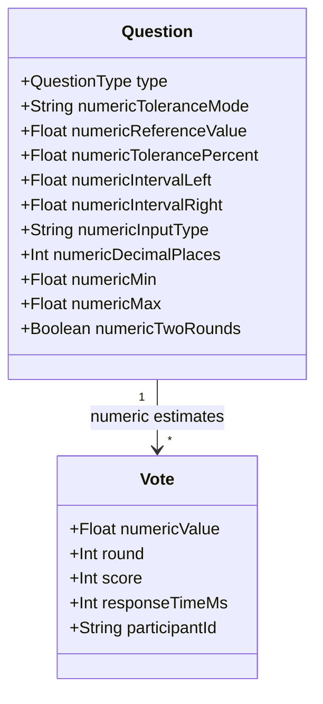
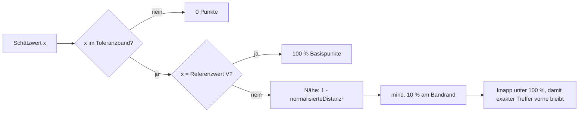
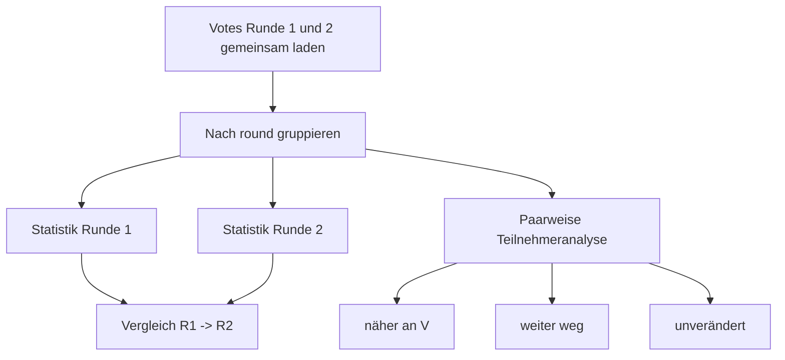

<!-- markdownlint-disable MD013 -->

# Numerische Schätzfrage (Story 1.2d)

> **Zielgruppe:** Product Owner, Entwickler, Lehrpersonen
> **Stand:** 2026-06-17 (Story 1.2d als implementiert bewertet)

## Zweck

Die numerische Schätzfrage ist ein eigener didaktischer Fragentyp `NUMERIC_ESTIMATE`. Sie ist für Fragen gedacht, bei denen Lernende eine Zahl schätzen, danach optional diskutieren und in einer zweiten Runde näher an einen Referenzwert herankommen sollen.

Typische Einsatzfälle:

- Jahreszahlen, Größenordnungen, Messwerte oder Wahrscheinlichkeiten schätzen.
- Vorwissen sichtbar machen, ohne sofort die Lösung zu verraten.
- Nach einer Diskussion prüfen, ob die Gruppe näher an den Referenzwert rückt.
- Große Gruppen ohne Herdeneffekt auswerten.

## Zwei Bänder: Plausibilität und Toleranz

Die Schätzfrage trennt zwei fachlich unterschiedliche Bereiche:

| Begriff            | Technisches Feld                                                                                       | Bedeutung                                                                                                                                       |
| ------------------ | ------------------------------------------------------------------------------------------------------ | ----------------------------------------------------------------------------------------------------------------------------------------------- |
| Plausibilitätsband | `numericMin`, `numericMax`                                                                             | Erlaubter Eingabebereich. Werte außerhalb werden gar nicht angenommen. Das Band verhindert offensichtliche Fehleingaben, ist aber keine Lösung. |
| Toleranzband       | `numericIntervalLeft`, `numericIntervalRight` oder `numericReferenceValue` + `numericTolerancePercent` | Bereich, in dem eine Schätzung als akzeptiert und mit Punkten bewertet wird.                                                                    |

Beispiel Jahresfrage:

- Referenzwert: `1789`
- Toleranzband: `1700` bis `1900`
- Plausibilitätsband: `1500` bis `2000`

Damit sind Schätzungen zwischen `1500` und `2000` eingebbar. Punkte gibt es nur zwischen `1700` und `1900`; der Wert `1789` ist der Referenzwert für Statistik, Nähebewertung und Rundenvergleich.

## Konfiguration



| Option                 | Werte                 | Regel                                                                                         |
| ---------------------- | --------------------- | --------------------------------------------------------------------------------------------- |
| Eingabetyp             | `INTEGER`, `DECIMAL`  | Integer-Fragen akzeptieren keine Dezimalwerte. Decimal-Fragen begrenzen die Nachkommastellen. |
| Dezimaltrennzeichen    | Komma oder Punkt      | `3,14` und `3.14` werden als derselbe Wert verstanden.                                        |
| Absolutes Intervall    | `L`, `R`              | Gültig nur mit `L < R`. Asymmetrische Intervalle sind erlaubt.                                |
| Relatives Toleranzband | `V`, `p`              | Band = `[V - abs(V) * p / 100, V + abs(V) * p / 100]`. `V = 0` ist nicht zulässig.            |
| Plausibilitätsgrenzen  | optional `min`, `max` | Eingaben außerhalb werden client- und serverseitig abgewiesen.                                |
| Zwei Runden            | an / aus              | Ohne zweite Runde läuft die Frage wie eine einfache Schätzrunde.                              |

## Ablauf

```mermaid
sequenceDiagram
  actor H as Host
  participant BE as Backend
  participant V as Teilnehmende
  participant DB as PostgreSQL

  H->>BE: session.nextQuestion
  BE-->>V: QuestionPreviewDTO (nur Fragenstamm)
  H->>BE: session.revealAnswers
  BE-->>V: QuestionStudentDTO (Eingabeformat, keine Lösung)
  V->>BE: vote.submit(numericValue, round=1)
  BE->>DB: Vote speichern und serverseitig validieren
  BE-->>H: onHostVoteProgressChanged(HostVoteProgressDTO)
  Note over BE,H: Nur neutraler Fortschritt; kein HostCurrentQuestionDTO pro Vote

  opt zweite Runde aktiviert
    H->>BE: session.startDiscussion
    BE-->>V: DISCUSSION
    H->>BE: session.startRound2
    BE-->>V: Runde 2 aktiv
    V->>BE: vote.submit(numericValue, round=2)
    BE->>DB: Vote getrennt nach Runde speichern
    BE-->>H: HostVoteProgressDTO fuer Runde 2
  end

  H->>BE: session.revealResults
  BE->>DB: Votes laden und aggregieren
  BE-->>H: Histogramm, Statistik, Rundenvergleich
  BE-->>V: eigener Wert, Referenz, Punkte, Nähefeedback
```

## Datenschutz und Herdeneffekt

Während `ACTIVE` und vor der Ergebnisfreigabe werden keine Schätzlagen übertragen oder angezeigt.

Erlaubt vor Freigabe:

- Status
- aktuelle Runde
- `submittedCount` / `participantCount`
- neutrale Fortschrittsanzeige

Nicht erlaubt vor Freigabe:

- Histogramm-Buckets
- Rohwerte
- Min/Max der abgegebenen Werte
- Mittelwert, Median, Standardabweichung, IQR
- Toleranztreffer oder Lösungsnähe
- `isCorrect` oder äquivalente Lösungsindikatoren

Der aktive Host-Pfad zählt deshalb nur Votes. Detaildaten werden erst in `RESULTS` geladen und aggregiert.

Technisch ist der aktive Host-Live-Pfad von der vollständigen Host-Frage getrennt:

- `HostCurrentQuestionDTO` transportiert Frage, Konfiguration und nach Freigabe Ergebnisdaten.
- `HostVoteProgressDTO` transportiert während `ACTIVE` nur `questionId`, `questionOrder`, `round`, `totalVotes` und optional abstrakte Korrekt-/Peer-Instruction-Zähler für Fragetypen ohne Lösungsverrat.
- `vote.submit` invalidiert nach einer Abgabe nicht mehr den vollständigen Host-Fragenkanal, sondern nur den Vote-Progress-Kanal.
- Vote-getriebene Progress-Signale werden kurz gebündelt; Status- und Fragewechsel signalisieren weiterhin sofort.

## Punkte und Korrektheit

Für Streak, Leaderboard und Scorecards gilt eine Schätzung als korrekt, wenn sie im Toleranzband liegt. Die Punkte innerhalb des Bands werden zusätzlich nach Nähe zum Referenzwert differenziert.



Die Nähe wird pro Seite des Referenzwerts normalisiert. Bei `V=1789`, linkem Bandrand `1700` und rechtem Bandrand `1900` wird eine Schätzung links gegen den Abstand `1789-1700`, eine Schätzung rechts gegen `1900-1789` skaliert.

Die finale Punktzahl bleibt in der allgemeinen Scoring-Regel:

```text
Basispunkte = MAX_BASE_POINTS * Nähefaktor
Fragepunkte = Schwierigkeit * Zeitfaktor * Basispunkte
Vote.score = Fragepunkte * Streak-Multiplikator
```

Runde 2 folgt der Effective-Vote-Regel: Gibt es für eine Frage eine Runde-2-Abgabe, ersetzt diese die Runde-1-Abgabe in Wettbewerbswertungen. Runde-2-Antwortzeiten werden nicht als Tiebreaker genutzt.

## Ergebnis- und Statistikansicht

Nach der Ergebnisfreigabe zeigt die Host-Ansicht:

- Histogramm der Schätzungen
- Referenzlinie
- Toleranzband
- Count-Badges pro Bucket
- Scoreboard bzw. Teamstand, sofern aktiv
- zusammenfassende Statistik
- Details im Expander

Statistische Werte:

| Wert                   | Bedeutung                                                                    |
| ---------------------- | ---------------------------------------------------------------------------- |
| `n`                    | Anzahl gültiger Schätzungen in der Runde.                                    |
| Mittelwert             | Summe aller Schätzungen geteilt durch `n`; empfindlich gegenüber Ausreißern. |
| Median                 | Mittlerer Wert der sortierten Schätzungen; robuster gegen Ausreißer.         |
| Standardabweichung `σ` | Typische Streuung um den Mittelwert.                                         |
| Q1 / Q3 / IQR          | Unteres und oberes Quartil; IQR = Streuung der mittleren 50 %.               |
| Min / Max              | Kleinste und größte Schätzung.                                               |
| Anteil im Band         | Prozent der Schätzungen im Toleranzband.                                     |
| MAE                    | Mittlerer absoluter Fehler `abs(x - V)`.                                     |
| MRE                    | Mittlerer relativer Fehler in %, nur wenn `V != 0`.                          |

Bei ganzzahligen Jahresfragen werden Werte ohne Dezimalstellen und ohne Tausenderpunkt dargestellt, damit z. B. `1789` als Jahreszahl lesbar bleibt.

## Zwei-Runden-Auswertung

Wenn `numericTwoRounds` aktiv ist, werden Runde 1 und Runde 2 getrennt gespeichert und nach Freigabe gemeinsam ausgewertet.



Teilnehmende mit nur einer Abgabe bleiben in den jeweiligen Rundenstatistiken enthalten. In die paarweise Analyse gehen nur Personen ein, die in beiden Runden eine gültige Schätzung abgegeben haben.

## Import aus arsnova.click

`RangedQuestion` aus arsnova.click wird bestmöglich auf `NUMERIC_ESTIMATE` gemappt:

- `correctValue` -> `numericReferenceValue`
- Dezimalstellen aus Grenzen und Referenzwert -> `numericInputType` / `numericDecimalPlaces`
- `rangeMin` / `rangeMax` -> absolutes Toleranzband `numericIntervalLeft` / `numericIntervalRight`
- kein separates Plausibilitätsband, weil arsnova.click dafür keine eigenen Grenzen exportiert
- vertauschte Grenzen werden korrigiert und als Warnung gemeldet

## Verifikation

Abgesicherte Bereiche:

- Shared-Types: Parsing, Toleranzauflösung, `V = 0`, `L < R`, Dezimalstellen.
- Backend: serverseitige Validierung, Vote-Speicherung, Nähe-Scoring, Scorecards, Leaderboards, Runde-2-Ersatz.
- Host: keine Ergebnisdaten während `ACTIVE`, Histogramm/Statistik erst in `RESULTS`, Rundenvergleich aus gemeinsamer Vote-Abfrage.
- Vote: Text-Input mit `inputmode`, Komma/Punkt-Unterstützung, rundenbezogene lokale Antworten, persönliche Scorecard und Nähe-Motivation.
- Smoke-Test: `apps/frontend/scripts/check-numeric-estimate-flow.mjs` mit Dark Theme, zwei Teams, 20 simulierten Abstimmungen und zwei Runden.
- Last-Smoke: `npm run load:smoke:host-vote-progress` mit standardmäßig 200 parallelen Votes prüft, dass Vote-Spitzen den Host-Progress aktualisieren, ohne den vollständigen Host-Fragenkanal zu fluten.

## Implementierungsanker

- Shared Types: [`libs/shared-types/src/schemas.ts`](../../libs/shared-types/src/schemas.ts)
- Scoring: [`apps/backend/src/lib/quizScoring.ts`](../../apps/backend/src/lib/quizScoring.ts)
- Vote-API: [`apps/backend/src/routers/vote.ts`](../../apps/backend/src/routers/vote.ts)
- Session-/Host-Aggregation: [`apps/backend/src/routers/session.ts`](../../apps/backend/src/routers/session.ts)
- Editor: [`apps/frontend/src/app/features/quiz/quiz-edit/quiz-edit.component.ts`](../../apps/frontend/src/app/features/quiz/quiz-edit/quiz-edit.component.ts)
- Host-Ansicht: [`apps/frontend/src/app/features/session/session-host/session-host.component.ts`](../../apps/frontend/src/app/features/session/session-host/session-host.component.ts)
- Vote-Ansicht: [`apps/frontend/src/app/features/session/session-vote/session-vote.component.ts`](../../apps/frontend/src/app/features/session/session-vote/session-vote.component.ts)
- Smoke-Test: [`apps/frontend/scripts/check-numeric-estimate-flow.mjs`](../../apps/frontend/scripts/check-numeric-estimate-flow.mjs)
- Last-Smoke: [`scripts/load/host-vote-progress-200.mjs`](../../scripts/load/host-vote-progress-200.mjs)
