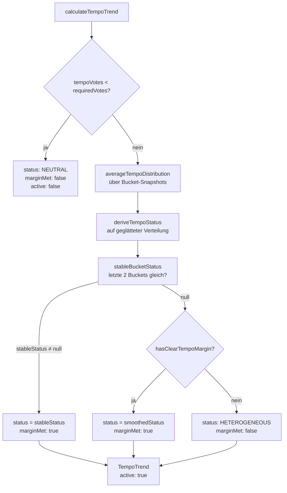

# Tempo-Tendenzberechnung

> **Zielgruppe:** Entwickler  
> **Implementierung:** `apps/backend/src/lib/quickFeedbackTempo.ts`  
> **Einbettung:** Wird von `quickFeedback.results` / `quickFeedback.onResults` als Feld `tempoTrend` geliefert, wenn das aktive Format `TEMPO` ist. Überblick zum Gesamtformat: [blitzlicht-quickfeedback-api.md](blitzlicht-quickfeedback-api.md).

---

## Datenbasis

Teilnehmende senden beim Tempo-Format eine von vier Optionen:

| Wert        | Bedeutung            |
| ----------- | -------------------- |
| `SPEED_UP`  | Zu langsam           |
| `FOLLOWING` | Kann gut folgen      |
| `SLOW_DOWN` | Etwas zu schnell     |
| `LOST`      | Abgehängt / verloren |

Jede Person hält **eine aktive Stimme** (mutable); Re-Tap auf die aktive Option entfernt sie. Die aktuellen Stimmen werden in Redis unter `qf:choices:<CODE>` je Voter und als aggregierte **Distribution** (`Record<TempoValue, number>`) gehalten.

Zusätzlich schreibt das Lua-Skript pro Vote einen Zeitstempel-Bucket in `qf:tempo:buckets:<CODE>`. Der Backend-Router liest beim Berechnen der Ergebnisse die letzten Buckets und übergibt sie als `snapshots` an `calculateTempoTrend`.

---

## FOLLOWING als Standardzustand

`FOLLOWING` ist der implizite Startzustand aller Teilnehmenden. Dies betrifft drei Ebenen:

### Vote-Client (Teilnehmende)

Beim Laden des Tempo-Formats zeigt die Vote-UI sofort das 🙂-Icon als **vorausgewählt** – ohne dass die Person etwas getippt hat (`selectedTempoValue` wird auf `'FOLLOWING'` gesetzt, `applyResult`, `feedback-vote.component.ts`).

Tippt jemand auf das bereits aktive 🙂, passiert **nichts** (Guard in `vote()`):

```ts
if (
  isTempo &&
  selectedTempoValue === TEMPO_DEFAULT_VALUE &&
  submittedValue === TEMPO_DEFAULT_VALUE
) {
  return; // kein Netzwerkaufruf
}
```

Nur die drei **Abweichungswerte** (`SPEED_UP`, `SLOW_DOWN`, `LOST`) werden in `localStorage` und in Redis persistiert. Ein Tap auf 🙂 von einem Abweichungswert aus sendet `FOLLOWING` ans Backend, was das Lua-Skript als Reset interpretiert (`resetsToDefault = true`) und den Redis-Eintrag für diese Person löscht.

### Redis-Skript (Backend)

Das Lua-Skript speichert `FOLLOWING` **nie** in `qf:choices:<CODE>`. Die Distribution in Redis enthält nur explizite Abweichungen; `FOLLOWING` wird vor dem Speichern immer auf `0` gesetzt:

```lua
distribution['FOLLOWING'] = 0
```

### Ergebnisberechnung (Backend)

Beim Berechnen der Host-Ergebnisse injiziert `applyTempoDefaultFollowing()` (in `quickFeedback.ts`) die impliziten FOLLOWING-Stimmen:

```
deviations       = SPEED_UP + SLOW_DOWN + LOST  (aus Redis)
participantBasis = max(activeParticipants, storedTotalVotes, deviations)
FOLLOWING_count  = max(0, participantBasis - deviations)
```

Alle online sichtbaren Teilnehmenden, die keine Abweichung eingetragen haben, zählen damit rechnerisch als FOLLOWING. Diese Injektion wird auch auf alle historischen Bucket-Snapshots angewandt (`tempoSnapshotsWithDefaultFollowing`), sodass Glättung und Stabilitätsprüfung konsistent arbeiten.

### Psychologische Wirkung

Sobald genug Teilnehmende online sind (`activeParticipants ≥ requiredVotes`), zeigt die Host-Ansicht unmittelbar den Trend **FOLLOWING / 🙂 (grün)** – ohne dass jemand aktiv abgestimmt hat. Vortragende erhalten damit von Beginn an ein positives Startsignal. Erst wenn Teilnehmende explizit auf `SPEED_UP`, `SLOW_DOWN` oder `LOST` tippen, verschiebt sich die Tendenz.

---

## Zeitfenster und Buckets

| Konstante                  | Wert | Bedeutung                                             |
| -------------------------- | ---- | ----------------------------------------------------- |
| `TEMPO_WINDOW_SECONDS`     | 60 s | Betrachtungshorizont (maximale Snapshot-Tiefe)        |
| `TEMPO_BUCKET_SECONDS`     | 15 s | Breite eines einzelnen Buckets → maximal 4 Buckets    |
| `TEMPO_MIN_REQUIRED_VOTES` | 3    | Absolutes Minimum an Stimmen für einen aktiven Status |

---

## Algorithmus (`calculateTempoTrend`)

### Schritt 1 – Mindestanzahl Stimmen

```
requiredVotes = max(TEMPO_MIN_REQUIRED_VOTES, ceil(activeParticipants × 0.1))
```

`activeParticipants` ist das Maximum aus der gemeldeten Online-Zahl und `tempoVotes`, damit ein hohes Abstimmungsvolumen nie die eigene Mindestanforderung unterschreitet.

Wenn `tempoVotes < requiredVotes`: Rückgabe `{ status: 'NEUTRAL', active: false, … }`. Es wird **keine** weitere Berechnung durchgeführt.

---

### Schritt 2 – Zeitgewichtete Glättung (`averageTempoDistribution`)

Über alle vorhandenen Bucket-Snapshots wird für jeden Wert ein **linear zeitgewichteter Mittelwert** gebildet. Snapshots sind aufsteigend nach Zeitstempel sortiert (ältester zuerst); der älteste Bucket erhält Gewicht 1, der neueste Gewicht n:

```
totalWeight = n × (n + 1) / 2
smoothed[v] = Σ (i + 1) × snapshot[i].distribution[v] / totalWeight
```

Falls keine Snapshots vorhanden sind, wird die aktuelle Distribution direkt verwendet. Die Zeitgewichtung stellt sicher, dass eine Erholung der Gruppe (z. B. niemand mehr LOST) innerhalb eines Buckets (15 s) im Trend sichtbar wird, statt erst nach Ablauf aller alten Buckets (bis zu 60 s).

---

### Schritt 3 – Status aus geglätteter Verteilung (`deriveTempoStatus`)

Hilfsfunktionen:

- `tempoRatio(v)` = `distribution[v] / activeParticipants`
- `problemRatio()` = `(SLOW_DOWN + LOST) / activeParticipants`

Entscheidungsregeln (in dieser Reihenfolge):

| Bedingung                                    | Status          |
| -------------------------------------------- | --------------- |
| `lost ≥ 12 %`                                | `LOST`          |
| `problems ≥ 22 %`                            | `TOO_FAST`      |
| `speedUp ≥ 22 %` **und** `problems < 10 %`   | `TOO_SLOW`      |
| `following ≥ 50 %` **und** `problems < 15 %` | `FOLLOWING`     |
| sonst                                        | `HETEROGENEOUS` |

---

### Schritt 4 – Stabilitätsprüfung über Buckets (`stableBucketStatus`)

Es werden die **letzten zwei qualifizierten Buckets** geprüft (je `totalVotes ≥ requiredVotes`). Zeigen beide denselben `deriveTempoStatus`-Status, wird dieser als `stableStatus` zurückgegeben – andernfalls `null`.

---

### Schritt 5 – Hysterese (`hasClearTempoMargin`)

Steht kein `stableStatus` zur Verfügung, muss der `smoothedStatus` **strengere Schwellwerte** erfüllen, bevor er übernommen wird:

| Status          | Bedingung für klare Marge                    |
| --------------- | -------------------------------------------- |
| `LOST`          | `lost ≥ 18 %`                                |
| `TOO_FAST`      | `problems ≥ 32 %`                            |
| `TOO_SLOW`      | `speedUp ≥ 32 %` **und** `problems < 8 %`    |
| `FOLLOWING`     | `following ≥ 65 %` **und** `problems < 10 %` |
| `HETEROGENEOUS` | immer `true`                                 |

---

### Schritt 6 – Finaler Status und `marginMet`

```
marginClear = hasClearTempoMargin(smoothedDistribution, smoothedStatus)
status      = stableStatus ?? (marginClear ? smoothedStatus : 'HETEROGENEOUS')
marginMet   = stableStatus !== null || marginClear
```

`marginMet` unterscheidet zwei HETEROGENEOUS-Bedeutungen:

| `status`        | `marginMet` | Bedeutung                                                |
| --------------- | ----------- | -------------------------------------------------------- |
| `HETEROGENEOUS` | `true`      | Gruppe ist aktiv gespalten (echtes HETEROGENEOUS) → 🐇🐢 |
| `HETEROGENEOUS` | `false`     | Signal noch unscharf, Fallback → 🤷                      |
| Alle anderen    | `true`      | Klarer Trend – Marge oder zwei stabile Buckets           |

Der finale `TempoTrend` enthält neben `status` und `marginMet` auch `active`, `activeParticipants`, `tempoVotes`, `requiredVotes`, `windowSeconds` und `bucketSeconds`.

---

## Gesamtfluss



---

## Mögliche Statuswerte

| Status          | `marginMet` | UI-Emoji | UI-Bedeutung                            |
| --------------- | ----------- | -------- | --------------------------------------- |
| `NEUTRAL`       | `false`     | ○        | Noch zu wenige Rückmeldungen            |
| `FOLLOWING`     | `true`      | 🙂       | Die Mehrheit kann folgen                |
| `TOO_FAST`      | `true`      | 🐢       | Es wirkt zu schnell                     |
| `TOO_SLOW`      | `true`      | 🐇       | Die Gruppe kann schneller mitgehen      |
| `LOST`          | `true`      | 🙈       | Mehrere Teilnehmende sind abgehängt     |
| `HETEROGENEOUS` | `true`      | 🐇🐢     | Die Rückmeldungen sind gemischt         |
| `HETEROGENEOUS` | `false`     | 🤷       | Signal noch unscharf – kein klares Bild |

Zod-Schema und TypeScript-Typen: `TempoTrendStatusEnum`, `TempoTrendSchema`, `TempoTrend` in `libs/shared-types/src/schemas.ts`.

---

## Designentscheidungen

- **Glättung statt Rohwert:** Verhindert sprunghafte Anzeigewechsel bei einzelnen Ein-/Aussteigen.
- **Stabilitätsprüfung vor Hysterese:** Zwei übereinstimmende Buckets liefern ein schnelles, verlässliches Signal ohne die Glättungsverzögerung.
- **Hysterese als Fallback:** Verhindert, dass ein knapp über dem Primärschwellwert liegender Wert sofort den Status wechselt; `HETEROGENEOUS` dient dabei als neutraler Ruhezustand.
- **`activeParticipants` als Nenner statt `tempoVotes`:** Teilnehmende, die noch keine Stimme abgegeben haben, fließen in den Nenner ein, damit ein 100%-Signal bei sehr geringer Beteiligung keine verlässliche Aussage suggeriert.
